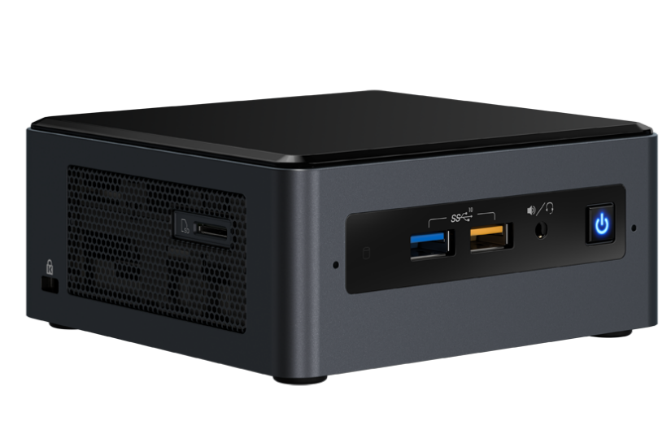
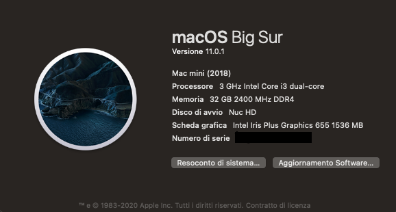
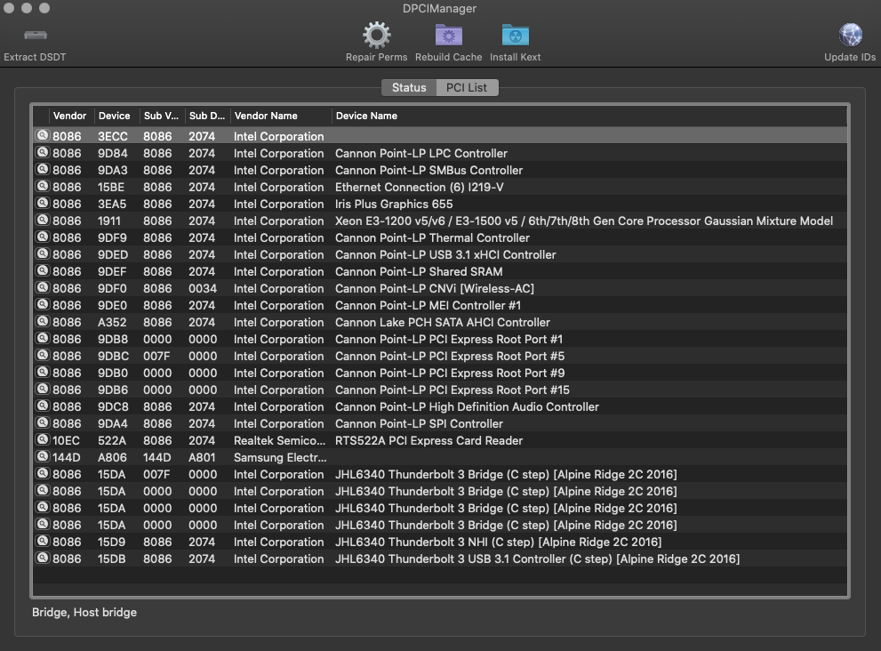
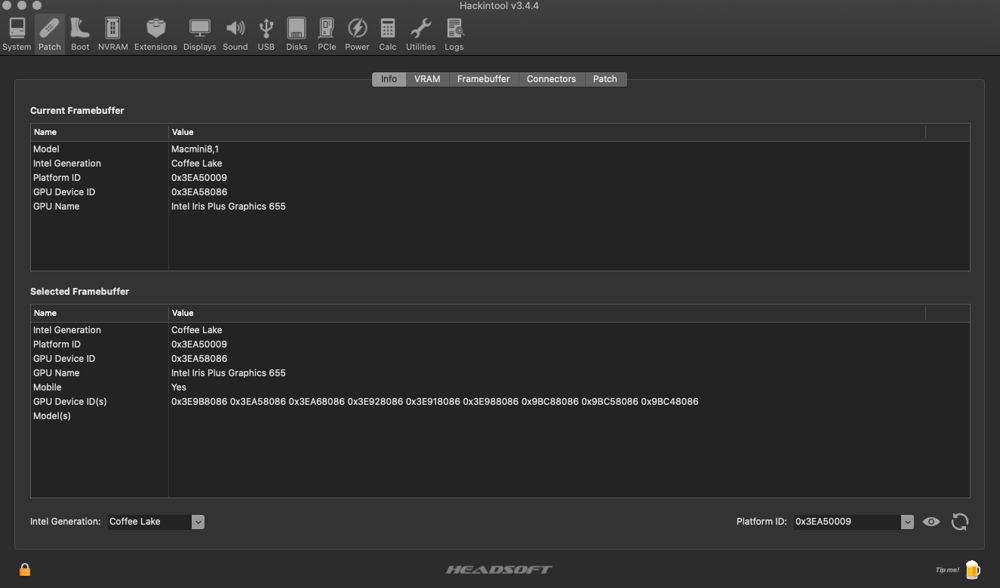
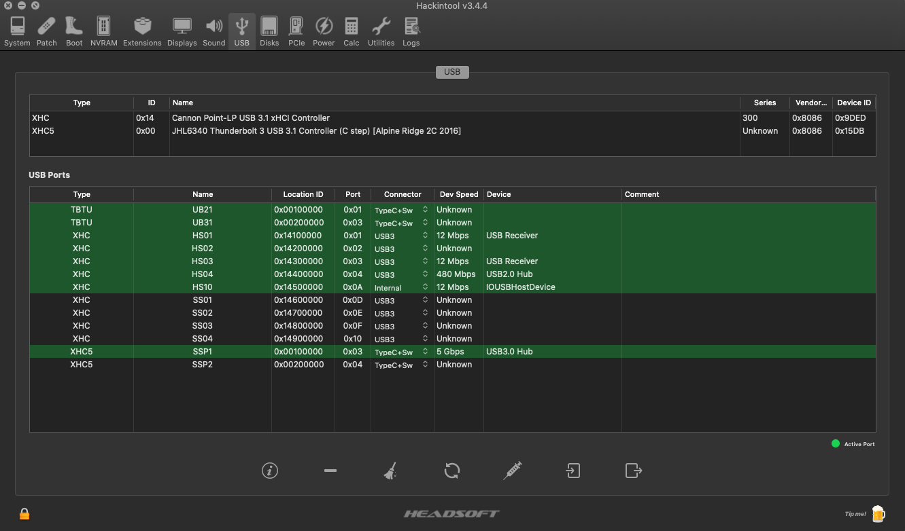
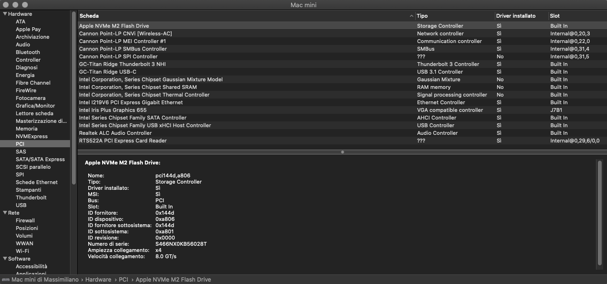
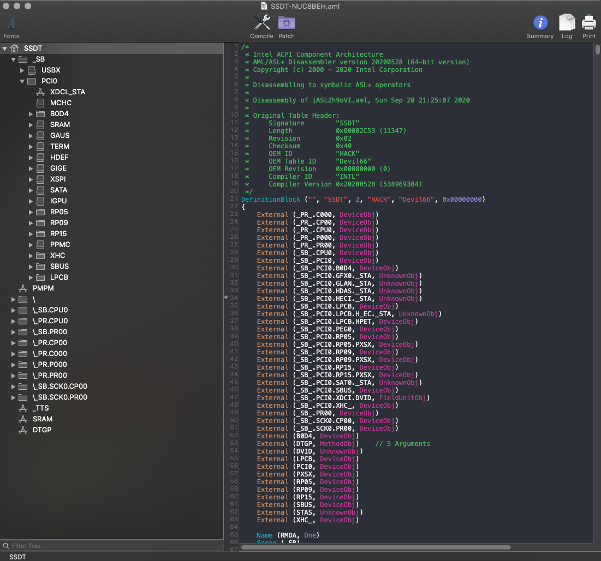

# Intel NUC8i3BEH Hackintosh

EFI for Intel NUC8i3BEH with OpenCore 0.6.4 bootloader

### Computer Spec:

| Component        | Brank                                  |
| ---------------- | ---------------------------------------|
| CPU              | Intel® Core™ i3-8109U                  |
| iGPU             | Intel® Iris® Plus 655                  |
| Lan              | Intel I219-V                           |
| Audio            | Realtek ALC235                         |
| Ram              | 32 Gb ddr4 2400 Mhz                    |
| Wifi + Bluetooth | Intel® Wireless-AC 9560 + Bluetooth 5.0|
| Nvme             | Samsung 970 evo plus 500GB             |
| SSD              | Samsung 850 evo 500 GB                 |
| Card Reader.     | microSDXC Card Reader                  |
| SmBios           | MacMini8,1                             |
| BootLoader       | OpenCore                               |

## Peripherals

### What works and What doesn't or WIP:

- [x] Intel Intel® Iris® Plus 655 iGPU HDMI Output
- [x] ALC235 Internal Speakers
- [x] ALC235 HDMI Audio Output
- [x] All USB Ports 
- [x] SpeedStep / Sleep / Wake
- [x] Intel I219-V
- [x] Thunderbolt 3 port
- [x] AC 9560 Wireless + Bluetooth
- [x] microSDXC Card Reader
- [x] NVRAM

### BIOS Settings:
To start, choose "Load Defaults" (choose from the menu or press F9 in the BIOS setup).

Then change:
- Boot->Boot Configuration, disable "Network Boot"
- Power->Secondary Power Settings, "Wake on LAN from S4/S5", set to "Stay Off"

These settings are important but are already set as needed by "Load Defaults"
- Devices->Video, "IGD Minimum Memory" set to 64mb or 128mb
- Devices->Video, "IGD Aperture Size" set to 256mb
- Boot->Secure Boot, "Secure Boot" is disabled
- Security->Security Features, "Execute Disable Bit" is enabled.

### Special Config:

- Usb port mapping performed
- Disabled unused device

### SSDT Info

See [ioreg](./macminik.ioreg) for more clarification

## Credits

- [Apple](https://apple.com) for macOS;
- [Acidanthera](https://github.com/acidanthera) for OpenCore and all the lovely hackintosh work.
- [Dortania](https://github.com/dortania)
- [mald0n](https://github.com/MaLd0n)
- [rehabman](https://github.com/RehabMan)
- [daliansky](https://github.com/daliansky)
- [Hackintoshlifeit](https://github.com/Hackintoshlifeit)

# If you need help please contact us on [Telegram](https://t.me/HackintoshLife_it) or [Web](https://www.hackintoshlife.it/)
