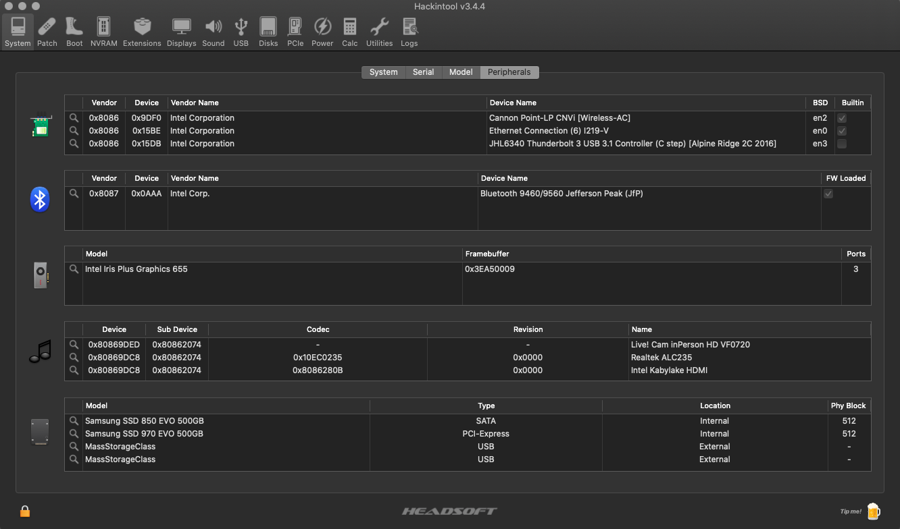
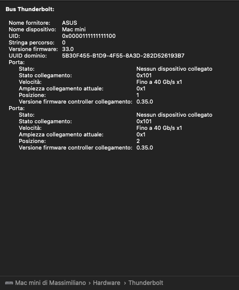

# Intel NUC8i3BEH Hackintosh

EFI for Intel NUC8i3BEH with OpenCore 0.6.6 bootloader

### Computer Spec:

| Component        | Brank                                  |
| ---------------- | ---------------------------------------|
| CPU              | Intel® Core™ i3-8109U                  |
| iGPU             | Intel® Iris® Plus 655                  |
| Lan              | Intel I219-V                           |
| Audio            | Realtek ALC235                         |
| Ram              | 32 Gb ddr4 2400 Mhz                    |
| Wifi + Bluetooth | Intel® Wireless-AC 9560 + Bluetooth 5.0|
| Nvme             | Samsung 970 evo plus 500GB             |
| SSD              | Samsung 850 evo 500 GB                 |
| Card Reader.     | microSDXC Card Reader                  |
| SmBios           | MacMini8,1                             |
| BootLoader       | OpenCore                               |

## Peripherals

### What works and What doesn't or WIP:

- [x] Intel Intel® Iris® Plus 655 iGPU HDMI Output
- [x] ALC235 Internal Speakers
- [x] ALC235 HDMI Audio Output
- [x] All USB Ports 
- [x] SpeedStep / Sleep / Wake
- [x] Intel I219-V
- [x] Thunderbolt 3 port
- [x] AC 9560 Wireless + Bluetooth
- [x] microSDXC Card Reader
- [x] NVRAM

### BIOS Settings:
To start, choose "Load Defaults" (choose from the menu or press F9 in the BIOS setup).

Then change:
- Boot->Boot Configuration, disable "Network Boot"
- Power->Secondary Power Settings, "Wake on LAN from S4/S5", set to "Stay Off"

These settings are important but are already set as needed by "Load Defaults"
- Devices->Video, "IGD Minimum Memory" set to 64mb or 128mb
- Devices->Video, "IGD Aperture Size" set to 256mb
- Boot->Secure Boot, "Secure Boot" is disabled
- Security->Security Features, "Execute Disable Bit" is enabled.

### Special Config:

- Usb port mapping performed
- Disabled unused device
- Patch Thunderbolt Firmware

### SSDT Info

See [ioreg](./macminik.ioreg) for more clarification

### Flashing Thunderbolt firmware
Power off the NUC and disconnect the power cable for 10 seconds
Power on the NUC and boot MacOS
Open System Report (Apple logo -> About This Mac -> System Report)
Under Thunderbolt, you should see the controller.

Copy ThunderboltPatcher folder to your computer (for more information about ThunderboltPatcher, go to https://github.com/osy86/ThunderboltPatcher)
This should only be done once. This is a safety measure - in case flashing fails, you will be able to restore the firmware using external programmer

Open Terminal and  launch
sudo ./tbpatch list
The response is 
/AppleACPIPlatformExpert/PCI0@0/AppleACPIPCI/RP05@1C,4/IOPP/UPSB@0/IOPP/DSB0@0/IOPP/NHI0@0/AppleThunderboltHAL/AppleThunderboltNHIType3/IOThunderboltController/IOThunderboltPort@5/IOThunderboltSwitchType3/IOThunderboltIECSNub/AppleHPMIECS/AppleHPMDevice@0
  Address : 0x00000000
  PID     : 0x2831454341
  UID     : 10AFF80F-EDF3-75BB-384D-42D28F2D5FCD
  Version :
  Build   : c21bda84555465022d578161e3aecb523fe75643_12082017
  Device  : TPS65982 HW0011 FW0001.12.07 ZTBT1
  
Perform backup with commands
sudo ./tbpatch dump -s 0x100000 -f backup.bin

This should take about 10-15 minutes to finish.

Patch the firmware with command
sudo ./tbpatch patch -f nuc8.plist

Power off the NUC and remove the power cable for 10 seconds

If you want to un-flash the controller (For Windows hot-plug), you can restore it to original settings.
In order to revert to original firmware, you should run the following
sudo ./tbpatch restore -f nuc8.plist
After that, power off, remove the power, wait 10 seconds and boot.

## Credits

- [Apple](https://apple.com) for macOS;
- [Acidanthera](https://github.com/acidanthera) for OpenCore and all the lovely hackintosh work.
- [Dortania](https://github.com/dortania) For great and detailed guides.
- [Osy](https://github.com/osy) For Thunderbolt Patcher
- [Hackintoshlifeit](https://github.com/Hackintoshlifeit) Support group for installation and post installation.

# If you need help please contact us on [Telegram](https://t.me/HackintoshLife_it) or [Web](https://www.hackintoshlife.it/)
